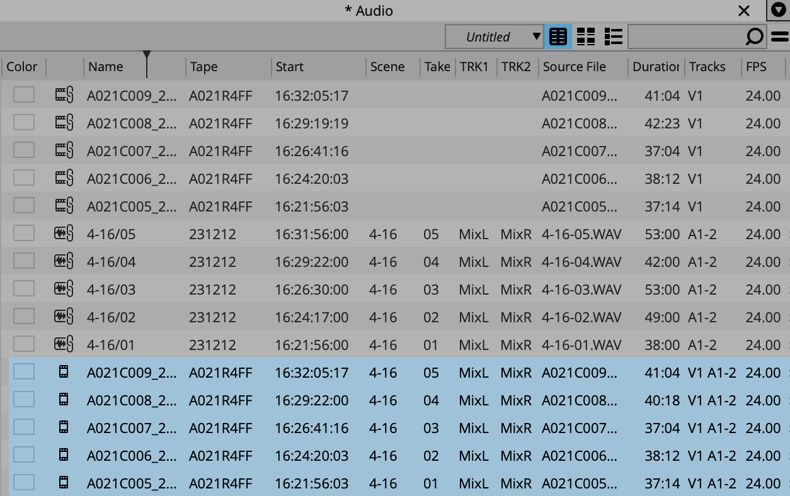
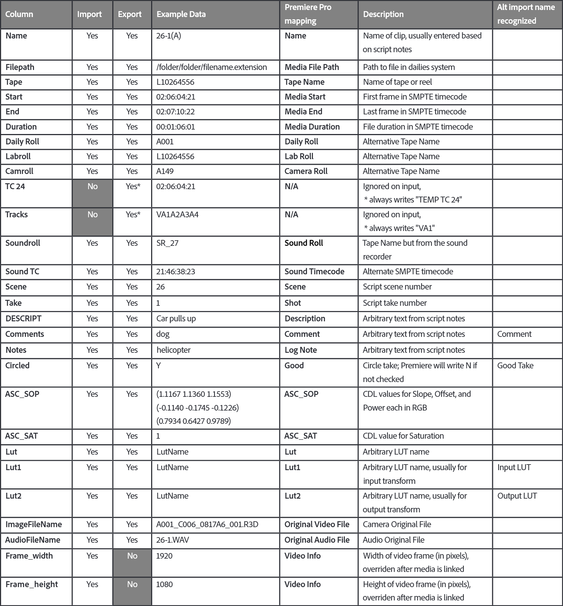

# 常用软件测试

本节聚焦于行业常用样片、剪辑、声音后期软件，对Tape、Start TC、Scene、Take、Note、UBITS、Track Name等关键字段进行测试，观察其在软件界面中的显示方式、在编辑操作中的持久性与完整性，以及在导出元数据表单、剪辑交接文件等衍生文件时的传承情况。测试重点包括字段含义是否发生偏移、字段是否在操作中丢失、以及不同格式导出后元数据是否能被正确读取并还原。

## 测试流程

测试用音频素材由两部分组成：

- 由Soundevice 688录制的原始BWF文件，具有完整且正确的bext和iXML元数据，用于测试常规工作流程。
- 在Soundevice 688的原始BWF文件基础上，使用BWF MetaEdit对元数据段进行手动修改，构造出bext与iXML对应字段内容冲突的特殊BWF文件，用于测试不同软件在解析声音元数据时的读取优先级与行为差异。

在样片制作与剪辑阶段，分别使用Avid Media Composer 2024.12、Davinci Resolve 19.1.4、Adobe Premiere Pro 2025软件进行剪辑，每个软件都分别测试两种合板流程：

- 先合板后转代理：使用Silverstack 8.4、DaVinci Resolve 19.1.4完成素材合板与代理转码，将代理文件和表单元数据导入剪辑软件，进行剪辑。
- 在剪辑软件中合板：使用Silverstack 8.4完成代理转码，直接在剪辑软件中合板，进行剪辑。

在此过程中，检查Silverstack与剪辑软件是否正确解析声音元数据到元数据栏；在剪辑软件的元数据栏中修改特殊BWF片段的元数据，用于后续验证剪辑过程的元数据修改操作能否体现在剪辑交付结果中。

在剪辑交付阶段，两种合板流程均导出EDL与AAF两种格式供声音后期使用，其中AAF分别包含内嵌式与链接式两种类型。针对AAF格式无法直接查看的限制，笔者根据pyaaf2库的示例开发了AAF Viewer软件，能够通过图形化的方式以不同视图展现AAF内部结构，便于检查AAF内的元数据是否正确。

导出后，使用文本编辑器查看EDL中的信息，使用AAF Viewer查看AAF中Mob的元数据；对于链接式AAF，还分别使用BWF MetaEdit与MXF Inspect查看其所关联的BWF与MXF媒体文件中的嵌入式元数据。鉴于DAW内部可能存在较为复杂的元数据解析机制，上述工具所得结果并不必然反映DAW中的最终表现，因此仍需将交接文件导入DAW进行检查，以确认元数据的最终传递结果。

在声音后期阶段，使用Pro Tools 2024.10作为声音编辑工作站，测试流程包括：

- 对于EDL，使用Ediload重新套底原始音频，生成PTX会话并导入到Pro Tools中。
- 对于内嵌式AAF，直接将文件导入Pro Tools中；对于链接式AAF，在导入后根据文件名重新链接对应的音频素材。
  - 此外，还尝试将原始BWF文件、特殊BWF文件、链接式AAF所关联的媒体文件单独导入Pro Tools，以观察其元数据解析行为。
  
- 为验证Pro Tools在读取AAF文件及其关联媒体时的元数据优先级，笔者以Avid Media Composer导出的内嵌式AAF与链接式AAF为基础分别创建副本，并使用pyaaf2库对副本中的元数据字段进行定向修改，在字段值中添加“_aaf”后缀，使其与媒体文件中原有的元数据值形成明确区分。将该类文件导入Pro Tools，进而分析软件在多重元数据来源中所采用的读取优先级策略。

导入完成后，在Pro Tools的时间线及Workspace中查看声音元数据，检查显示值是否与AAF或媒体文件中的值一致。

## 测试结果

### 样片软件合板

#### Silverstack

Silverstack读取BWF文件的结果如表1所示。

表1 Silverstack导入BWF的元数据解析情况

| 媒体池字段        | iXML | bext | 备注                                               |
| ----------------- | ---- | ---- | -------------------------------------------------- |
| Reel/Tape         | ✅    | ❌    |                                                    |
| Scene             | ✅    | ❌    | 将BWF中的Scene按“-”拆分，“-”前为Scene，“-”后为Shot |
| Shot              | ✅    | ❌    |                                                    |
| Take              | ✅    | ❌    |                                                    |
| TC Start          | ✅    | ❌    |                                                    |
| Comment           | ✅    | ❌    |                                                    |
| UBITS             | /    | /    |                                                    |
| Audio Track Names | ✅    | ❌    |                                                    |

使用Silverstack输出ALE和CSV格式的元数据表单：

- 输出ALE：ALE中的相关列包含Scene、Take、Soundroll、Sound TC、TRK[N]，场次可按照需要组合。
- 输出CSV：CSV中的相关列包含Scene、Shot、Take、Soundroll、Audio Start TC、Track[N]。

#### DaVinci Resolve

DaVinci Resolve读取BWF文件的结果如表2所示。

表2 Davinci Resolve导入BWF音频的元数据解析情况

| 媒体池字段         | iXML | bext | 备注                                               |
| ------------------ | ---- | ---- | -------------------------------------------------- |
| Reel Name          | ❌    | ❌    |                                                    |
| Sound Roll #       | ✅    | ❌    | bext信息仅存储媒体池Desciption中，不映射其中字段。 |
| Scene              | ✅    | ❌    |                                                    |
| Take               | ✅    | ❌    |                                                    |
| Start TC           | ✅    | ❌    |                                                    |
| Comments           | ✅    | ❌    | 对应BWF的Note字段                                  |
| Track 1、Track 2…… | ✅    | ❌    |                                                    |

使用DaVinci Resolve输出ALE和CSV格式的元数据表单：

- 输出ALE：ALE中的相关列包含Scene、Take、Soundroll、Sound TC、Comments、TRK[N]。
- 输出CSV：CSV中的相关列包括Scene、Shot、Take、Sound Roll #、Comments、Track[N]。

后文使用DaVinci Resolve输出的元数据表单进行“先合板后转代理”流程的测试。

### Avid Media Composer剪辑

#### 合板

在先合板后转代理流程中，通过ALE将元数据合并到代理主片段中。Avid MC支持自定义字段的拓展，ALE中的所有元数据都映射到媒体池同名字段中。其中一个片段的元数据如表3所示：

表3 Avid Media Composer通过ALE合并元数据到主片段的结果

| 媒体池字段   | 导入ALE前的值 | 导入ALE后的值 |
| ------------ | ------------- | ------------- |
| Tape         | A021          | A021          |
| Start        | 16:24:31:12   | 16:24:31:12   |
| Scene        | /             | 4-16          |
| Take         | /             | 1             |
| Soundroll    | /             | 231212        |
| Sound TC     | /             | 16:24:31:10   |
| Comments     | /             | Mr.Zhang      |
| UBITS        | /             | /             |
| TRK1、TRK2…… | /             | MixL、MixR……  |

在剪辑软件合板流程中，Avid MC可采用AMA Link和Import两种方法导入BWF，对应的元数据解析情况如表4、表5所示。

表4 Avid Media Composer通过AMA Link导入BWF的元数据解析情况

| 媒体池字段   | iXML | bext | 备注                   |
| ------------ | ---- | ---- | ---------------------- |
| Tape         | ✅    | ✅    | iXML优先               |
| Scene        | ✅    | ✅    | iXML优先               |
| Take         | ✅    | ✅    | iXML优先               |
| Start        | ✅    | ✅    | iXML优先               |
| Comments     | ✅    | ✅    | iXML优先，对应Note字段 |
| UBITS        | ✅    | ✅    | iXML优先               |
| Soundroll    | ❌    | ❌    |                        |
| Sound TC     | ❌    | ❌    |                        |
| TRK1、TRK2…… | ✅    | ❌    | iXML优先               |

表5 Avid Media Composer通过Import导入BWF的元数据解析情况

| 媒体池字段   | iXML | bext | 备注                   |
| ------------ | ---- | ---- | ---------------------- |
| Tape         | ❌    | ✅    | bext优先               |
| Scene        | ❌    | ✅    | bext优先               |
| Take         | ❌    | ✅    | bext优先               |
| Start        | ❌    | ✅    | bext优先               |
| Comments     | ❌    | ✅    | bext优先，对应Note字段 |
| UBITS        | ❌    | ✅    | bext优先               |
| Soundroll    | ❌    | ❌    |                        |
| Sound TC     | ❌    | ❌    |                        |
| TRK1、TRK2…… | ✅    | ❌    | iXML优先               |

使用AutoSync功能合板创建包含音视频的Subclip（子片段），Subclip保持对主片段的引用，能够正确继承音视频主片段的元数据，如下图所示。

#### 交付

导出EDL时需使用List Tool，该工具功能完备，允许用户导出EDL时使用媒体池特定列作为数据源，从而自定义Reel和Timecode的值；导出AAF时可选择媒体存储方式、存储格式。整理时间线并导出EDL、链接MXF媒体的AAF、内嵌BWF的AAF等交接文件，其元数据信息如表6所示。

表6 Avid MC输出剪辑交接文件的元数据情况

| 载体               | 字段                      | 来源   | 信息                           |
| ------------------ | ------------------------- | ------ | ------------------------------ |
| EDL                | Reel                      | 媒体池 | ✅，使用音频片段Tape或Soundroll |
|                    | Timecode                  | 媒体池 | ✅，使用音频片段TC或Sound TC    |
| AAF的Mob           | Tape(Tape SourceMob Name) | 媒体池 | ✅                              |
|                    | Timecode                  | 媒体池 | ✅                              |
|                    | UserComments.Scene        | 媒体池 | ✅                              |
|                    | UserComments.Take         | 媒体池 | ✅                              |
|                    | UserComments.TRK[N]       | 媒体池 | ✅                              |
|                    | UserComments.UBITS        | 媒体池 | ✅                              |
|                    | UserComments.Comments     | 媒体池 | ✅                              |
| 链接式AAF关联的MXF | Tape(SourcePackage Name)  | 媒体池 | ✅                              |
|                    | Timecode                  | 媒体池 | ✅                              |
|                    | TaggedValue.Scene         | 媒体池 | ✅                              |
|                    | TaggedValue.Take          | 媒体池 | ✅                              |
|                    | TaggedValue.TRK[N]        | 媒体池 | ✅                              |
|                    | TaggedValue.UBITS         | 媒体池 | ✅                              |
|                    | TaggedValue.Comments      | 媒体池 | ✅                              |

### Premiere剪辑

#### 合板

在先合板后转代理流程中，通过ALE导入代理素材时Premiere的行为与Avid MC类似，但存在几点不同：

1. Premiere中有多个Metadata Schema（元数据模式），最常使用的是默认的Premiere Pro Project Metadata。下文表7、8的字段都是Premiere Pro Project Metadata的字段。
2. Premiere Pro Project Metadata中缺少Take字段，ALE中的Take将被映射到Premiere中的Shot字段中。
3. Premiere不解析ALE中的轨道名称（TRK1……）。 

表7 Premiere导入ALE前后的元数据变化

| 媒体池字段     | 导入ALE前的值 | 导入ALE后的值 |
| -------------- | ------------- | ------------- |
| Tape Name      | A021          | A021          |
| Media Start    | 16:24:31:12   | 16:24:31:12   |
| Scene          | /             | 4-16          |
| Shot           | /             | 1             |
| Sound Roll     | /             | 231212        |
| Sound Timecode | /             | 16:24:31:10   |
| Comment        | /             | Mr.Zhang      |

在剪辑合板流程中，将BWF导入Premiere，对应的解析结果如表8所示。其中BWF的Shot被读取到媒体池的Shot Number字段中，与Premiere Pro Project Metadata不通用。导入完成后，笔者根据BWF的Take值手动填写了媒体池Shot字段，用于后续交付剪辑交接文件。

表8 Premiere导入BWF音频的元数据解析情况

| 媒体池字段      | iXML | bext | 备注                                                  |
| --------------- | ---- | ---- | ----------------------------------------------------- |
| Tape Name       | ✅    | ❌    | bext中的Description仅以文本形式显示，不映射其中字段。 |
| Media Start     | ✅    | ❌    |                                                       |
| Scene           | ✅    | ❌    |                                                       |
| Shot            | ❌    | ❌    | 即使BWF中的Take不为空，Shot的值也默认为空             |
| Log Note        | ✅    | ❌    | 对应BWF的Note字段                                     |
| iXML Track List | ✅    | ❌    |                                                       |
| Sound Roll      | ❌    | ❌    |                                                       |
| Sound Timecode  | ❌    | ❌    |                                                       |

Premiere中存在多种方式合板方法。根据Adobe官方的最佳实践，若要在跨部门交接时保留声音元数据，应使用多机位序列、子序列等在后续操作中可解嵌的方式进行合板，而不应使用合并片段、嵌套序列难以解嵌的方式，后者极易导致元数据无法向下游部门传递。因此，本文使用Premiere中的多机位序列功能进行合板，使用生成的多机位序列为源进行剪辑，完成剪辑后拼合时间线上的多机位序列，将其还原为对应的主片段。

注：使用多机位序列合板时，若音频轨道选择“自适应”，可能导致最后输出链接式AAF时BWF文件中轨道名错误，只有第一轨的信息。

#### 交付

导出EDL时，Use Soundroll/Sound Timecode选项会影响EDL中的Reel、Timecode值，该选项启用时优先使用Sound Roll、Sound Timecode栏信息，这两栏为空或该选项禁用时则使用Tape Name、Media Start栏信息。因此，两种合板流程中均需启用此选项。
导出AAF时，Use tape sources when present选项将影响AAF中的SourceMob，该选项启用时，若片段在媒体池中Tape Name值不为空，File SourceMob下则引用Tape SourceMob；Tape Name值为空或该选项禁用时，File SourceMob则引用Import SourceMob，致使AAF中声音卷名缺失。需注意的是，由于该选项只读取Tape Name栏，而不读取Sound Roll栏，先合板后转码流程中即使打开该选项，AAF中的Tape SourceMob Name也无法与原始BWF的Tape匹配。

整理时间线并导出EDL、链接BWF媒体的AAF、内嵌BWF的AAF等交接文件，其元数据信息如表9所示。

表9 Premiere输出剪辑交接文件的元数据情况

| 载体               | 字段                      | 来源   | 信息                  |
| ------------------ | ------------------------- | ------ | --------------------- |
| EDL                | Reel                      | 媒体池 | ✅                     |
|                    | Timecode                  | 媒体池 | ✅                     |
| AAF的Mob           | Tape(Tape SourceMob Name) | 媒体池 | ✅                     |
|                    | Timecode                  | 媒体池 | ✅                     |
|                    | UserComments.Scene        | 媒体池 | ✅                     |
|                    | UserComments.Take         | 媒体池 | ✅，与媒体池Shot值一致 |
|                    | UserComments.TRK[N]       | /      | ❌                     |
|                    | UserComments.UBITS        | /      | ❌                     |
|                    | UserComments.Comments     | /      | ❌                     |
| 链接式AAF关联的BWF | 所有iXML和bext字段        | 源BWF  | ✅                     |

### DaVinci Resolve剪辑

#### 合板

在先合板后转代理流程中，通过CSV将元数据合并到代理主片段中，达芬奇仅支持从CSV中合并媒体池原生字段的值，匹配字段都映射到媒体池同名字段中。达芬奇CSV支持Shot字段，可在需要时使用。

表10 DaVinci Resolve导入CSV前后的元数据变化

| 媒体池字段         | 导入CSV前的值 | 导入CSV后的值 |
| ------------------ | ------------- | ------------- |
| Reel Name          | A021          | A021          |
| Start TC           | 16:24:31:12   | 16:24:31:12   |
| Scene              | /             | 4-16          |
| Take               | /             | 1             |
| Sound Roll #       | /             | 231212        |
| Comments           | /             | Mr.Zhang      |
| Track 1、Track 2…… | /             | MixL、MixR……  |

在剪辑软件合板流程中，将BWF导入Davinci Resolve，对应的解析结果如上文表2所示。

达芬奇媒体池中的合板功能将BWF音轨替换或附加到视频片段的音轨中，形成合板后的片段。默认情况下retain video metadata选项被禁用，BWF片段的Sound Roll #、Scene、Shot、Take、Comments、Track[N]字段内容将覆盖视频片段的对应值，使声音元数据保留到合板后片段中。

#### 交付

达芬奇无法将合板后片段直接替换为原始的主片段。

导出EDL时，EDL中Reel值和Timecode值均不可指定，其中Reel默认来自Reel Name栏，Timecode值来自Start TC栏。由于BWF的的Tape值位于Sound Roll #栏中无法被调用，且BWF的Start TC值与合板后片段的视频TC不一致时会被视频TC值覆盖，达芬奇该功能无法直接导出具有正确声音元数据的EDL。

导出AAF时，需使用交付页面中的Pro Tools预设。由于Pro Tools读取AAF时只支持Mono格式的音频，该预设默认启用Render one track per channel选项。整理时间线，在剪辑页面导出EDL，在交付页面禁用导出视频的选项，导出内嵌BWF的AAF、链接BWF的AAF、链接MXF的AAF，其元数据信息如表11所示。

表11 DaVinci Resolve输出剪辑交接文件的元数据情况

| 载体               | 字段                     | 来源   | 信息                                 |
| ------------------ | ------------------------ | ------ | ------------------------------------ |
| EDL                | Reel                     | 媒体池 | ❌，来自视频Reel Name                 |
|                    | Timecode                 | 媒体池 | ❌，来自视频TC                        |
| AAF的Mob           | Tape(SourceMob Name)     | /      | ❌                                    |
|                    | Timecode                 | 媒体池 | ✅                                    |
|                    | UserComments.Scene       | /      | ❌                                    |
|                    | UserComments.Take        | /      | ❌                                    |
|                    | UserComments.TRK[N]      | /      | ❌                                    |
|                    | UserComments.UBITS       | /      | ❌                                    |
|                    | UserComments.Comments    | /      | ❌                                    |
| 链接式AAF关联的BWF | Track List               | 源BWF  | ⭕，Stereo片段只有Track 1的轨道名正确 |
|                    | 其他iXML和bext字段       | 源BWF  | ✅                                    |
| 链接式AAF关联的MXF | Tape(SourcePackage Name) | /      | ❌                                    |
|                    | Timecode                 | /      | ✅                                    |
|                    | TaggedValue.Scene        | /      | ❌                                    |
|                    | TaggedValue.Take         | /      | ❌                                    |
|                    | TaggedValue.TRK[N]       | /      | ❌                                    |
|                    | TaggedValue.UBITS        | /      | ❌                                    |
|                    | TaggedValue.Comments     | /      | ❌                                    |

### Pro Tools

#### BWF读取

将测试用的原始BWF文件与特殊BWF文件导入PT中，对应的解析结果如表12所示。其中根据Pro Tools手册，Sound Roll栏表示BWF的Tape值，Tape栏表示OMF等文件中的来自Avid剪辑系统的Tape值。

表12 Pro Tools导入BWF音频的元数据解析情况

| 媒体池字段          | iXML | bext | 备注     |
| ------------------- | ---- | ---- | -------- |
| Tape                | ❌    | ❌    |          |
| Sound Roll          | ✅    | ✅    | iXML优先 |
| Scene               | ✅    | ✅    |          |
| Take                | ✅    | ✅    |          |
| Original Time Stamp | ✅    | ✅    |          |
| File Comment        | ✅    | ✅    |          |
| User Bits           | ✅    | ✅    |          |
| Channel Names       | ✅    | ✅    |          |

#### AAF及媒体文件读取

将前文中各剪辑软件导出的AAF及经特殊修改后的AAF导入Pro Tools中，分别查看Pro Tools Workspace中的元数据。先使用特殊AAF测试Pro Tools解析AAF及媒体文件的元数据来源，结果如表13所示。

表13 Pro Tools解析AAF及媒体文件的元数据来源

| Workspace字段       | 内嵌BWF的AAF | 链接BWF的AAF | 链接MXF的AAF |
| ------------------- | ------------ | ------------ | ------------ |
| Tape                | AAF的Mob     | 无           | MXF          |
| Sound Roll          | AAF的Mob     | BWF          | 无           |
| Scene               | AAF的Mob     | BWF          | MXF          |
| Take                | AAF的Mob     | BWF          | MXF          |
| Original Time Stamp | AAF的Mob     | AAF的Mob/BWF | AAF的Mob/MXF |
| File Comment        | 无           | BWF          | MXF          |
| User Bits           | AAF的Mob     | BWF          | MXF          |
| Channel Names       | AAF的Mob     | BWF          | MXF          |

可以观察到，对于内嵌式的AAF，Pro Tools直接从AAF的Mob中读取所有元数据。对于链接式AAF，Pro Tools基本直接从音频文件中读取所有元数据，且即使音频文件中的元数据为空，也不从AAF的Mob中读取；较为特殊的是，时间线中的Original Time Stamp从AAF中读取，Workspace中的Original Time Stamp从音频文件中读取。

随后，使用剪辑软件的AAF在Workspace的结果与AAF Viewer、BWF MetaEdit、MXF Inspect的结果交叉比对，验证元数据的值与优先级是否正确。

Pro Tools Workspace中的元数据读取结果如表14所示。

表14 各剪辑软件导出的AAF在Pro Tools中的元数据读取测试结果

| Workspace字段       | Avid MC |         | Premiere |         | Davinci |         |         |
| ------------------- | ------- | ------- | -------- | ------- | ------- | ------- | ------- |
|                     | 内嵌BWF | 链接MXF | 内嵌BWF  | 链接BWF | 内嵌BWF | 链接BWF | 链接MXF |
| Tape                | ✅       | ✅       | ✅        | ❌       | ❌       | ❌       | ❌       |
| Sound Roll          | ✅       | ❌       | ✅        | ✅       | ❌       | ✅       | ❌       |
| Scene               | ✅       | ✅       | ✅        | ✅       | ❌       | ✅       | ❌       |
| Take                | ✅       | ✅       | ✅        | ✅       | ❌       | ✅       | ❌       |
| Original Time Stamp | ✅       | ✅       | ✅        | ✅       | ✅       | ✅       | ✅       |
| File Comment        | ❌       | ✅       | ❌        | ✅       | ❌       | ✅       | ❌       |
| User Bits           | ✅       | ✅       | ❌        | ✅       | ❌       | ✅       | ❌       |
| Channel Names       | ✅       | ✅       | ❌        | ✅       | ❌       | ✅       | ❌       |

可以观察到，Pro Tools中读取元数据值与优先级能够与其他工具中的值对应，且优先级符合特殊AAF的测试结果。在此基础上，可以根据Pro Tools所读取的元数据开展声音回套等一系列后期工作。

## 潜在问题

综合前文的测试流程及测试结果，可以总结出流程中存在的几点潜在问题：

- 字段冲突与信息提取：视频和音频都需要使用卷名、时码字段，然而合板后的新文件、新片段往往只能有唯一的卷号、时间码，因此软件需做额外处理以避免冲突。例如，合板时将音频信息映射到单独的Soundroll、Sound TC栏中，并在向声音交接时指定使用该栏的内容；或在导出时从合板后的新片段向声音主片段回溯并使用其元数据。然而，实际操作中部分软件未能提供完整支持，导致元数据丢失的情况时有发生，典型问题包括：
  - 在声画时码不一致的手动合板流程中，若采用先合板后转代理流程，即使将表单元数据导入剪辑软件中，剪辑软件输出交接文件时仅引用视频元数据，导致交接文件中声音元数据错误或缺失。
  - 在剪辑软件中使用嵌套片段、复合片段等方式合板，若软件无法在导出交接文件自动解开嵌套结构，会导致声音元数据无法映射到交接文件中。
- 软件行为不透明：软件输出交接文件时，调用片段元数据的逻辑缺少相关文档说明；软件版本迭代中对元数据字段的处理逻辑存在调整，但更新日志未必详尽记录，造成用户在实际项目中难以及时发现行为变化，影响工作流程的稳定性与可预测性。
- 解析优先级影响结果：当交接文件中存在多个元数据来源时，DAW在读取元数据时所采用的优先级策略会直接影响解析结果。例如：
  - 在“先合板后转代理”的流程中，假设剪辑软件输出的链接式AAF中Mob有元数据、BWF无元数据，DAW若只解析BWF中的元数据，便会导致元数据丢失。
  - 在“在剪辑软件中合板”的流程中，假设剪辑软件输出的内嵌式AAF中Mob无元数据，DAW若只解析AAF Mob的元数据，便会导致元数据丢失。
